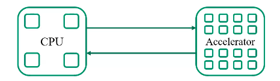

# Day 2 

## Lecture 2 notes

### CPU and GPU

- CPU: Latency Oriented Design
  - high clock frequency
  - large caches
    - convert long latency memory accesses to short latency cache accesses
  - sophiscated control
    - branch prediction for reduced branch latency (e.g. if-else branches): prediction accuracy can get to 99%
    - data forwarding for reduced data latency
  - powerful ALU (Arithmetic Logic Unit)
- GPU: Throughput Oriented Design (inherently good for parallel computing)
  - moderate clock frequency (2-4 times slower than CPU)
  - small caches
    - to boost memory throughput, rather than to keep track of data you need to use again later (like CPU)
  - simple control
    - no branch prediction
    - no data forwarding
  - energe efficient ALUs
    - many, long latency but heavily pipelined for high throughput
  - require massive number of threads to tolerate latencies
- Winning strategies use both CPU and GPU
  - CPU for sequential parts where latency hurts
    - CPUs can be 10+x faster than GPU for sequential code
    - e.g.: 10th Gen Intel Core processor
      - 10 cores silicon
      - 14 nm process
  - GPUs for parallel parts where throughput wins
    - GPUs can be 10+x faster than CPUs for parallel code
    - e.g.: NVIDIA GK110
      - 2880 CUDA cores
      - 28 nm process
  - Heterogeneous programming
  
- Parallel Programming Workflow
  - identify compute intensive parts of an application
  - adopt/create scalable algorithms
  - optimize data arrangements to maximize locality
  - performance tuning
  - pay attention to code portability, scalability, and maintainability
- Algorithm complexity and data scalability
  - algorithm complexity = compute complexity
    - quadratic: compute bound, not a good fit for GPU
    - nlog(n) or linear: throuput bound, good fit for GPU
- Parallel computing considerations
  - Problem 1: Load Balance
    - less variation is better. The total amount of time of a parallel job is the thread that takes the longest to finish
  - Problem 2: Global Memory Bandwidth
    - think carefully about how to get data onto and off the chip so that we can utilize the compute as much as possible
    - Scaling of compute is much faster than bandwidth
      - hardware FLOPS (compute): 90000x/20 yrs
      - DRAM bandwidth (DDR, GDDR3, HBM2, etc.): 30x/20 yrs
      - Interconnect bandwidth (PCIe 1.0a, PCIe 2.0, PCIe 3.0, NVLink 1.0, NVLink 3.0)
  - Problem 3: Conflicting data accesses cause serialization and delays
    - Massively parallel execution cannot affort serialization
    - Contentions in accessing critical data causes serialization
  - What is the stake?
    - Scalable and portable software lasts through many hardware generations
    - *Scalable algorithms and libraries can be the best legacy we can leave behind from this era*

### CUDA

- Learning items
  - basic concept of data parallel computing
  - basic features of the CUDA C programming interface

- Thread as a Basic Unit of Computing
  - What is a thread? A thread can include:
    - program
    - process (program counter)
    - context
      - memory
      - registers
  - Multiple threads (2x)
    - subtle interaction between threads
  - Many threads (1000s)
    - no interactions, all threads do the same thing, *independently*, *in parallel*
- CUDA/OpenCL execution model
  - integrated host+device app C program
    - serial or modestly parallel parts in host C code
    - highly parallel parts in device SPMD (single program multiple data) kernel C code
- Kernel executes as Grid of Uniquely Identified Threads
  - CUDA kernel executes as a grid (multi-dimensional array) of threads
  - All threads in grid
    - run the same kernel code, called a SPMD (*sungle program multiple data*) model
  - Each thread has a unique index, used to
    - compute memory addresses, and
    - make control decisions
```C
i = threadIdx.x
C[i] = A[i] + B[i];
```
---
## Lecture 3 notes

### CUDA (continued)
- Logical Execution Model for CUDA: 
  - grid > (thread) blocks > threads
  - Each CUDA kernel
    - is executed by a **grid**, which is
    - a 3D array of **thread blocks**, which are
    - 3D arrays of **threads**
      - each thread has a unique identifier (block.x.thread.x, y, z)
  - Each thread
    - executes the **same program**
    - on **distinct data inputs**
    - this is called a *single program, multiple data (SPMD)* model
  - Size and Idx
    - Grid size and index tuple
      - `gridDim`: Num of blocks in each dimension of the grid: 
        - `gridDim.x`
        - `gridDim.y` 
        - `gridDim.z`
      - for 2D (and 1D) grids, use grid dimension **1** for Z (and Y)
    - (Thread) block size and index tuple
      - `blockDim`: Num of threads in each dimension of the block
        - `blockDim.x` (0 to gridDim.x-1)
        - `blockDim.y` (0 to gridDim.y-1)
        - `blockDim.z` (0 to gridDim.z-1)
    - Thread idx: unique to each thread **within a block**
      - `threadIdx.x` (0 to blockDim.x-1)
      - `threadIdx.y` (0 to blockDim.y-1)
      - `threadIdx.z` (0 to blockDim.z-1)
  - Thread blocks: scalable cooperation
    - threads within a block cooperate via **shared memory**, **atomic operations**, and **barrier synchronization** (also **global atomic**, which is the only way to sync across blocks but very slow and to be avoided)
    - threads in different blocks cooperate less
  ```
    i = blockIdx.x * blockDim.x + threadIdx.x;
    C[i] = A[i] + B[i];
  ```