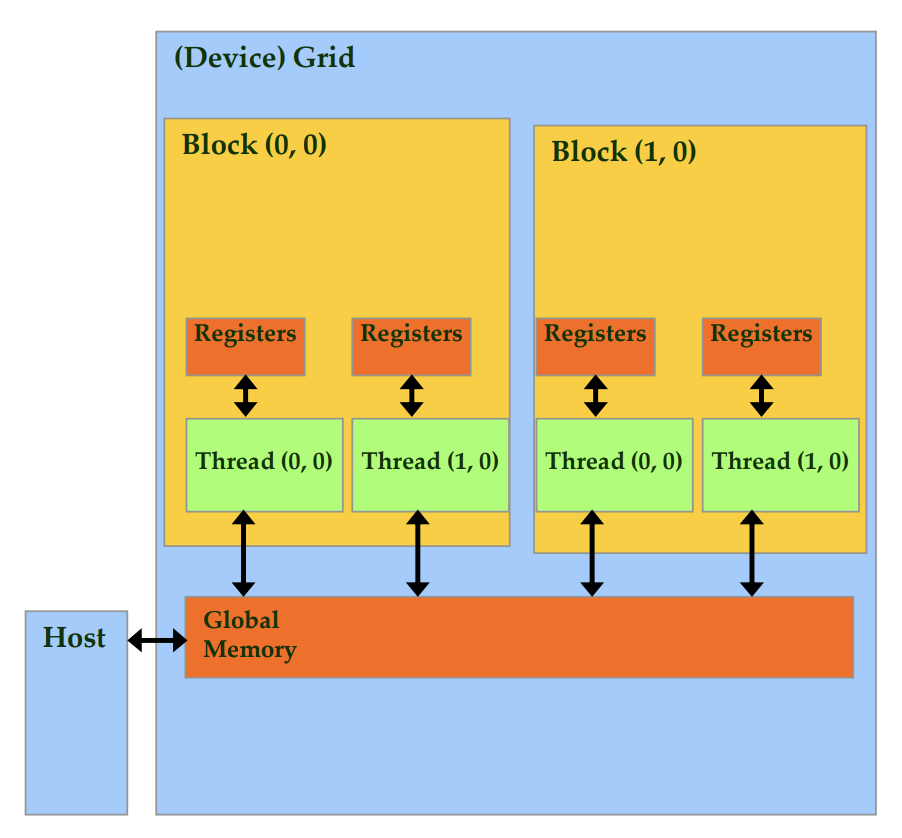

# Day 3

## Lecture 3 notes (continued)

- [recording](https://mediaspace.illinois.edu/media/t/1_joyw26bq) 25:00~end
- [deck 2](https://lumetta.web.engr.illinois.edu/408-Sum24/slide-copies/ece408-lecture2-CUDA-introduction-Sum24.pdf) P15~P28

### Partial Overview of CUDA Memories


- Device code (GPU code) can
  - R/W per-thread **registers**
    - register size: 64K per processor, divided among thread blocks on the same SM (streaming multiprocessor), 10-100 registers per thread
  - R/W per-grid **global GPU memory**
    - accessible to all threads in the grid, but not guaranteed to be instantly visible to all threads
  - Any call to a kernel function is *asynchronous* from CUDA 1.0 on. Explicit sync needed for blocking
- Host code (CPU code) can
  - **Allocate memory** for per-grid global memory
  - **Transfer data to/from** per-grid **global GPU memory** 
    - use RDMA to move data across PCIe
- CUDA device memory management API functions
  - `cudaMalloc`
    - allocate in **device global memory**
    - accepts two parameters
      - address to store the pointer to the allocated memory (ess. a pointer to a pointer)
      - size in bytes of allocated memory
  - `cudaFree`
    - **free allocated device global memory**
    - one parameter: **pointer** to the memory to free (returned from `cudaMalloc`)
  - `cudaMemcpy`
    - **memory data transfer**
    - four parameters
      - pointer to **destination**
      - pointer to **source**
      - number of bytes copied
      - Type/Direction of transfer: host to device or device to host
        - cudaMemcpyHostToDevice
  - Code example
```c
// device code - the kernel

// Compute vector sum C = A + B
// Each thread performs one pair-wise addition
__global__
void vecAddKernel(float* A_d, float* B_d, float* C_d, int N)
{
    int i = blockIdx.x * blockDim.x + threadIdx.x;
    if(i < N) C_d[i] = A_d[i] + B_d[i]; // so that we don't do anything outside of the array boundary
}
```
  
```c
// host code
void vecAdd(float* A, float* B, float* C, int N)
{
    int size = N * sizeof(float); // size of memory to allocate for each float 
    float *A_d, *B_d, *C_d; // pointers to the float arrays on device

    // 1. Allocate device memory for A, B, and C
    cudaMalloc((void **) &A_d, size); // Parameter 1 is a pointer to the float array A in GPU memory - With cudaMalloc, you always need to manually cast parameter 1 to a pointer to a pointer of void: (void **). Parameter 2, size, is the memory size needed to store the value.
    cudaMalloc((void **) &B_d, size);
    cudaMalloc((void **) &C_d, size);

    // 1.1 Copy A, B to device memory - do error checking
    cudaMemcpy(A_d, A, size, cudaMemcpyHostToDevice);
    cudaMemcpy(B_d, B, size, cudaMemcpyHostToDevice);

    // 2. Kernel invocation
    // Run ceil(N/256.0) blocks of 256 threads each
    // <<<>>> tells that the program wants to launch a CUDA kernel, with grid and block dimensions given as two numbers (this is a shorthand to say we want 1-dimension grids and blocks)
    vecAddKernel<<<ceil(N/256.0), 256>>>(A_d, B_d, C_d, N)

    // 3. Transfer C from device to host
    cudaMemcpy(C, C_d, size, cudaMemcpyDeviceToHost);
    // 3.1 Free device memory for A, B, C
    cudaFree(A_d);
    cudaFree(B_d);
    cudaFree(C_d);
}
``` 
To specify 3-dimensional grid and block dimensions in the host code, use `dim3` dimensions.
```c
int vecAdd(float* A, float* B, float* C, int N)
{
    // A_d, B_d, C_d allocations and copies omitted
    // Run ceil(N/256.0) blocks of 256 threads each
    dim3 DimGrid(ceil(N/256.0), 1, 1); // num of blocks per grid dimension
    dim3 DimBlock(256, 1, 1); // num of threads per block dimension

    vecAddKernel<<<DimGrid, DimBlock>>>(A_d, B_d, C_d, N);
}
```
---
## Lecture 4 notes

- [recording](https://mediaspace.illinois.edu/media/t/1_z883mlnv)
- [deck 2](https://lumetta.web.engr.illinois.edu/408-Sum24/slide-copies/ece408-lecture2-CUDA-introduction-Sum24.pdf) P27~

### Finish deck 2
- More on CUDA Function Delarations
  - `__device__ float DeviceFunc()`
    - executed on: device
    - callable from: device (e.g., from a kernel)
  - `__global__ void KernelFunc()`
    - executed on: device
    - callable from: host
    - has to return `void`
  - `__host__ float HostFunc()`
    -  executed on: host
    -  callable from: host
  -  `__device__` and `__host__` can be used together in front of one function, two versions (one for device and one for host) of it will be compiled

- Compiling A CUDA program
  - Integrated C programs with CUDA extensions ->
    - NVCC Compiler ->
      - Host Code
        - Host C Compiler/Linker
      - Device Code (PTX) intermediate device code
        - Device Just-in-Time Compiler (optimize when you need to run it, since only then you know the micro architecture it will be run on)
    - -> Heterogeneous Computing Platform with CPUs and GPUs

